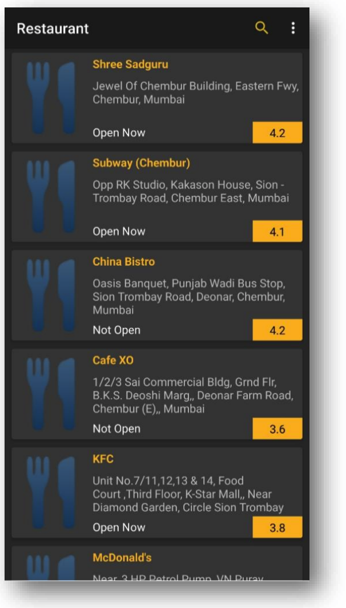
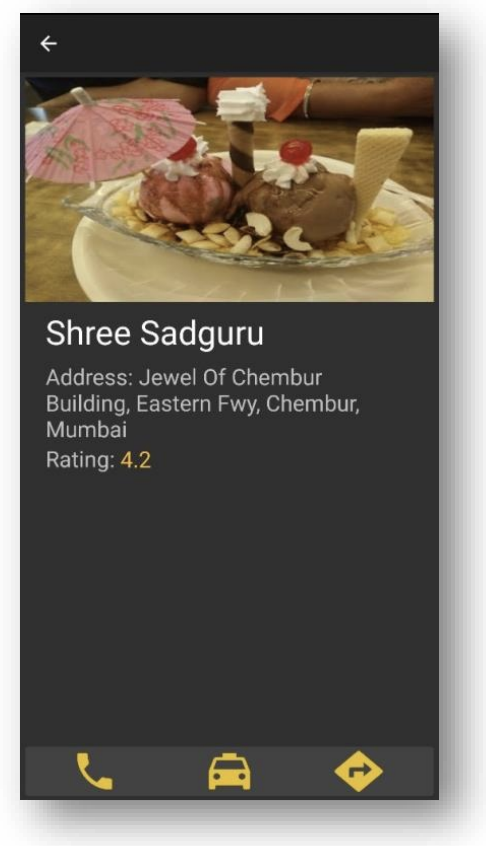

# Night-Navigator(Night Life)
A Night Life is an android based groupware having different motives to render services to
end user. As such now there is no other application which can provide " multiple but definite"
features from various fields , hence as a result , we came with a ideology of developing this
application which consists of :- nearby lodge/ restaurants , chemists, navigation to the desired
route ,at the same time giving much prominence at the "Night Time".
We thought necessary to build this project because it may help a user who is in need , let it be
in case of emergency or desire for anything, mainly during the hours of darkness, making it
more responsive and secure.
To give an Example:
* Searching for nearest Hospitals available at night and for the chemist at the same time.
* Nearest Restaurants or inn available.

## Screenshots:

### Login/Register

### Homescreen
 

### Restaurant Page

### Lodge Page

### Chemist Page

### Cabs Page

### Detail place page

